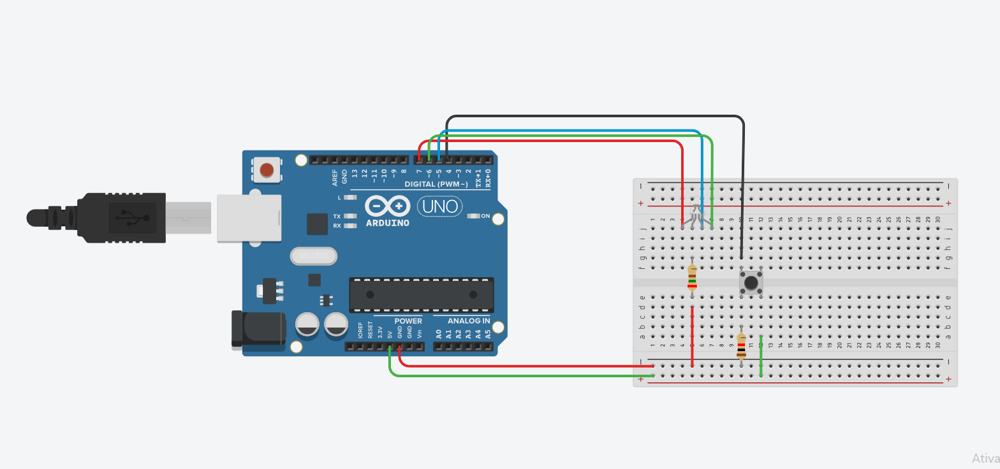

Descrição

Este pequeno projeto tem como objetivo controlar um LED usando um botão.
Quando o botão é pressionado, o LED alterna entre as cores.
É um exercício básico para aprender sobre:

Leitura de pinos digitais

Controle de saída digital

Uso de resistores pull-down ou pull-up

Lógica de alternância de estados

Materiais

1 x Arduino Uno (ou similar)

1 x LED RGB

1 x Resistor 220Ω (para o LED)

1 x Botão (push-button)

1 x Resistor 10kΩ (pull-down, se necessário)

Fios jumpers

Protoboard

Montagem

Conecte o LED:

RED, GREEN, BLUE nas respectivas portas digitais

Catodo (perna menor) → GND

Conecte o botão:

Um lado → 5V

Outro lado → pino digital 4 do Arduino

Resistor de 10kΩ entre o pino digital e GND (pull-down)
